# WhatsApp: identity, phone approval, and a saved named request

[Template](../../../templates/whatsapp.md) · [All walkthroughs](../README.md) · [Account setup](../../../using-sponsor-tools.md#whatsapp-identity-and-phone-approval)

This app uses **OpenAI Agents SDK + CopilotKit Channels + Auth0**, with direct Meta WhatsApp delivery. Auth0 and Meta setup screenshots below come from real development accounts. Meta confirmed delivery of an outbound Hello World test message. An inbound conversation through this app, Auth0 linking, Guardian approval, saved receipt, and restart journey remain unverified.

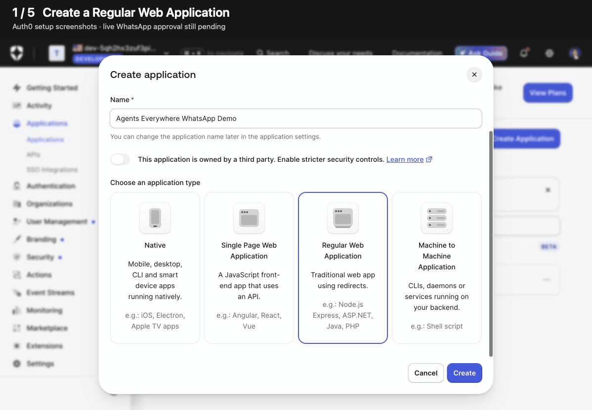

This 20-second GIF steps through the five setup screenshots below. It is not a recording of a WhatsApp conversation.

## 1. Prepare the Auth0 application and device

Follow the [Auth0 application and user setup](../../../using-sponsor-tools.md#auth0-application-and-user). Confirm CIBA entitlement/enabling first. Configure a confidential Regular Web Application, authorization code + CIBA grants, the API audience and `create:requests` permission, and the public callback URL. Enable **Guardian push only**, disable email fallback, and enroll the test user's Guardian device.

**Captured September 11, 2026:** the following screens are from an actual development tenant. They document configuration; no Guardian challenge has yet been approved.

Create a **Regular Web Application** for the server’s confidential login and CIBA client.

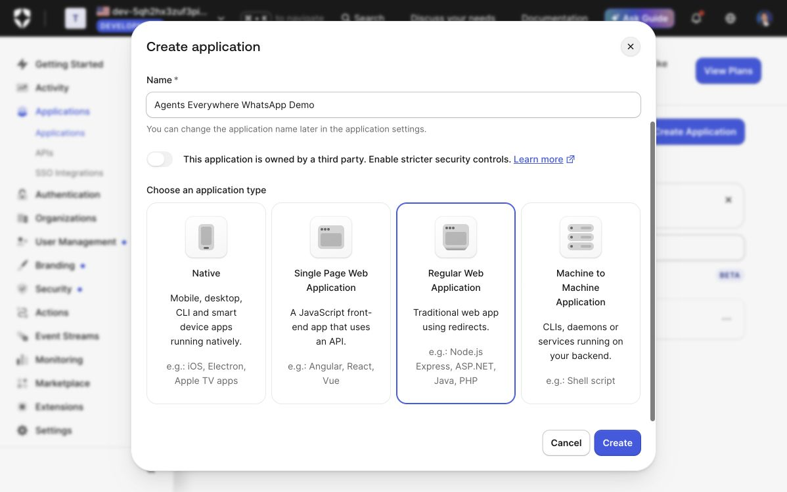

Create the API permission, enable RBAC, and grant this application user-delegated access to `create:requests`. Confirm **1 / 1 permissions granted** in the app’s row.

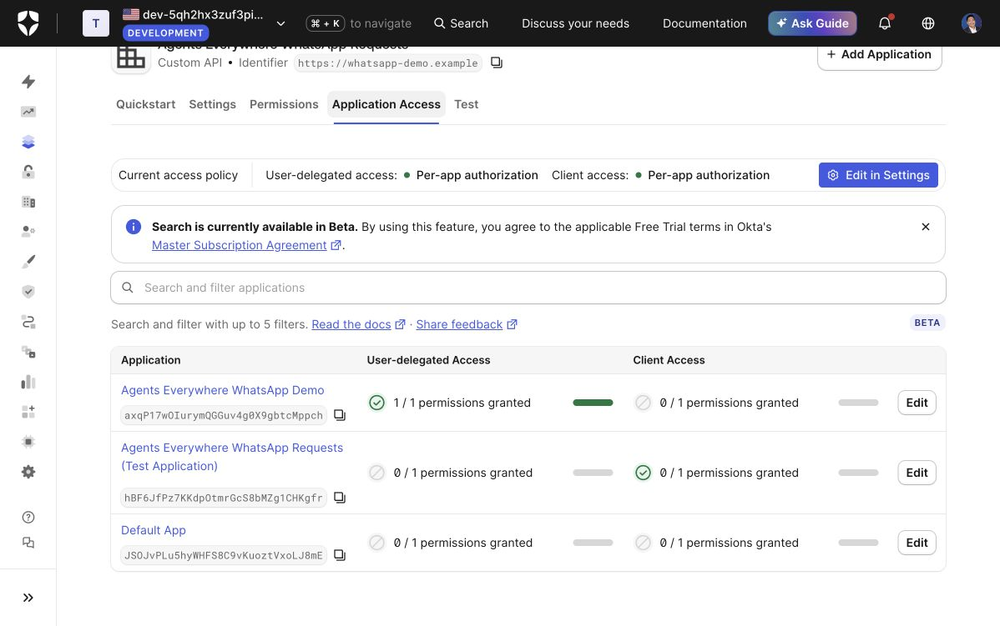

Add the same API permission to a requester role. Assign that role to the application user after their first login; a dashboard administrator is a separate identity.

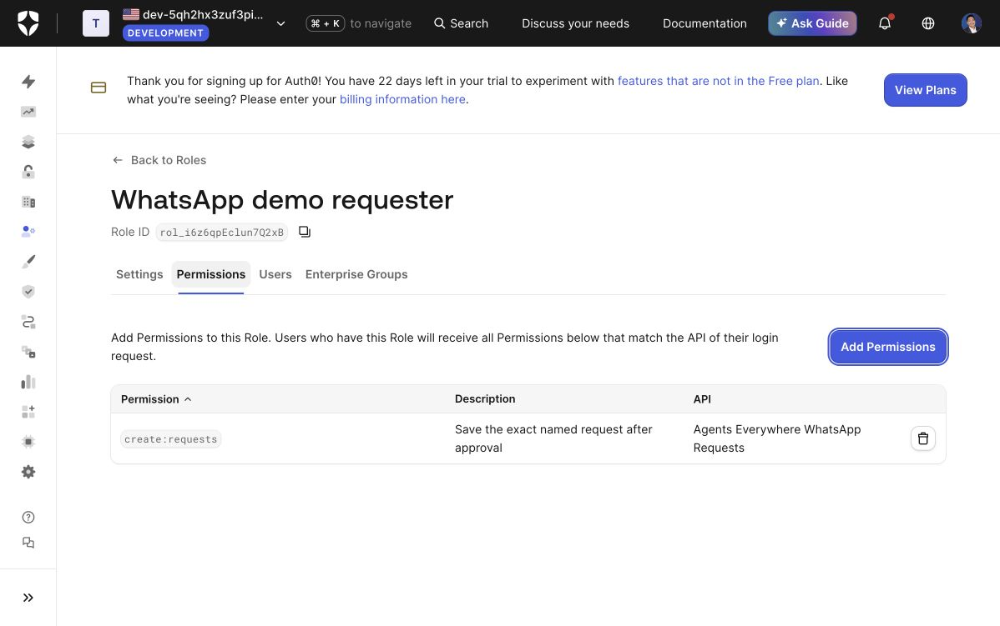

Enable **Push Notification using Auth0 Guardian** and select the **Auth0 Guardian** app. The phone illustration on this settings page is Auth0’s preview, not a captured approval. Configure the application’s CIBA notification channel as Guardian push only, then require MFA for the demo user’s login.

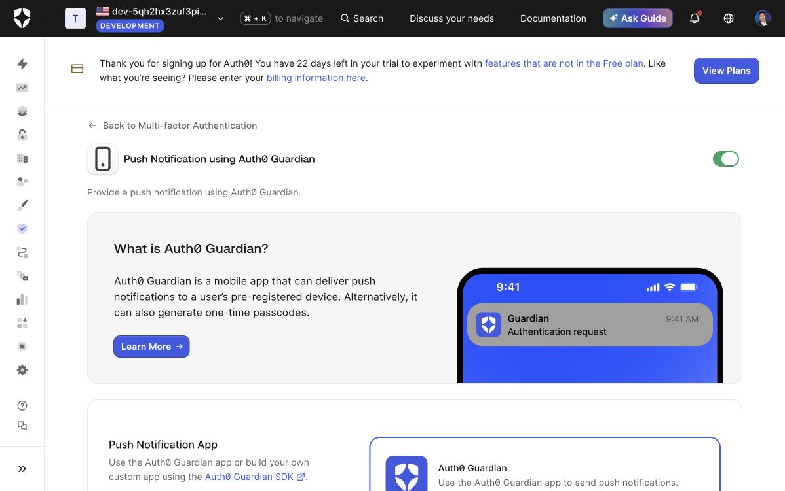

In **Advanced Settings → Grant Types**, enable **Authorization Code** and **Client Initiated Backchannel Authentication (CIBA)** and save. The saved settings below show both grants, Guardian push enabled, and email disabled. The demo tenant also has its MFA policy set to **Always** so the first login requests enrollment.

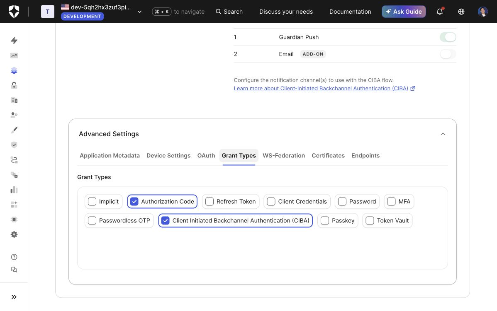

**Capture pending:** actual application-user role assignment and device enrollment. Exclude client secrets, tokens, enrollment QR codes, and private user data.

## 2. Configure Meta and the public origin

Follow [Meta and Channels setup](../../../using-sponsor-tools.md#whatsapp-transport-setup-meta--copilotkit-channels). The following onboarding screens were captured on September 11, 2026.

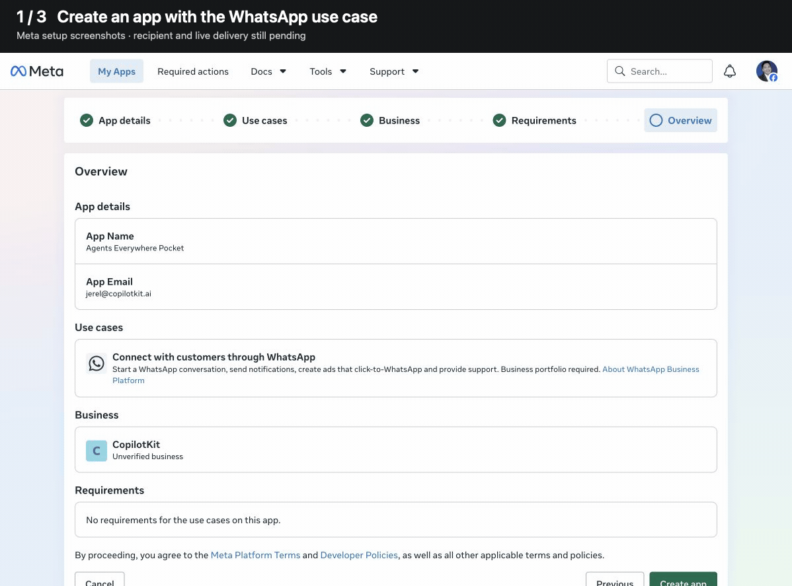

This 12-second GIF walks through the three Meta screenshots below. It shows app creation and the provisioned test number; no phone message has been sent in this capture.

1. Sign in to Meta for Developers and open **My Apps → Create App**. Enter an app name and your work contact email. In this run, Meta rejected a name containing its “WhatsApp” trademark, so the demo uses **Agents Everywhere Pocket**.
2. Select **Connect with customers through WhatsApp**. Choose a business portfolio you control, or create one using your public business name. Review the app details and select **Create app**. This development demo uses the new CopilotKit portfolio; its business verification remains incomplete.

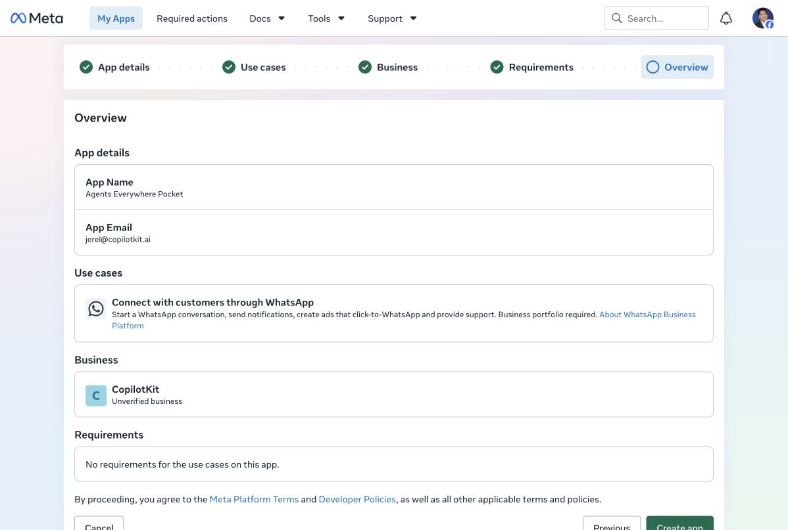

3. On the new dashboard, select **Customize the Connect with customers through WhatsApp use case**. The app is still unpublished.

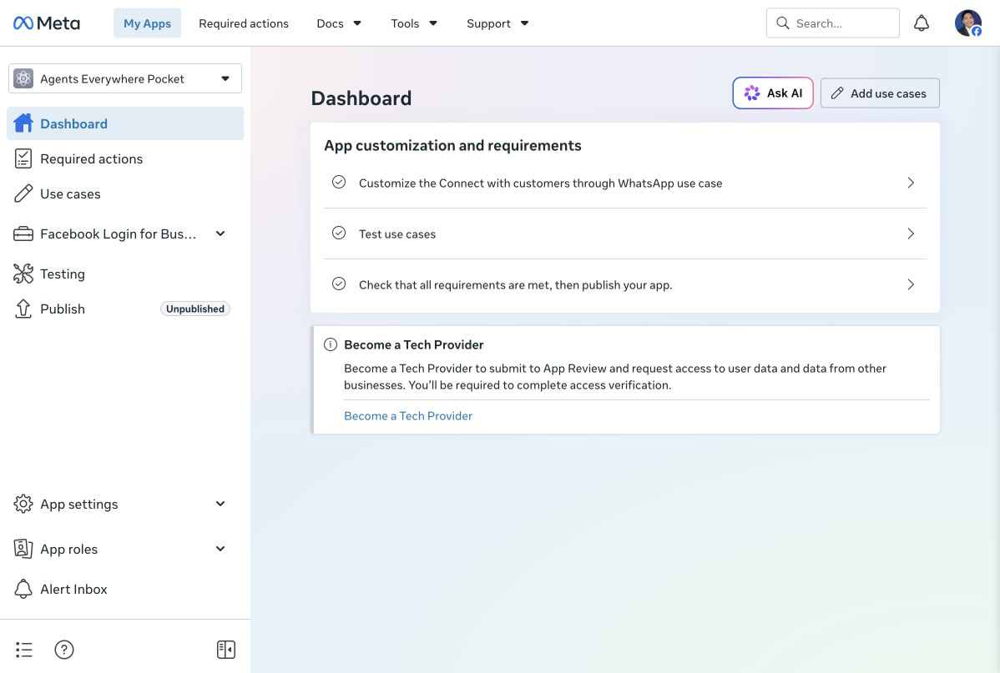

4. Continue with the selected portfolio, then open **Basic setup → Step 1. Try it out**. Meta provisions a test phone number and displays its **Phone Number ID** and WhatsApp Business account ID. The screenshot below was taken before generating an access token.

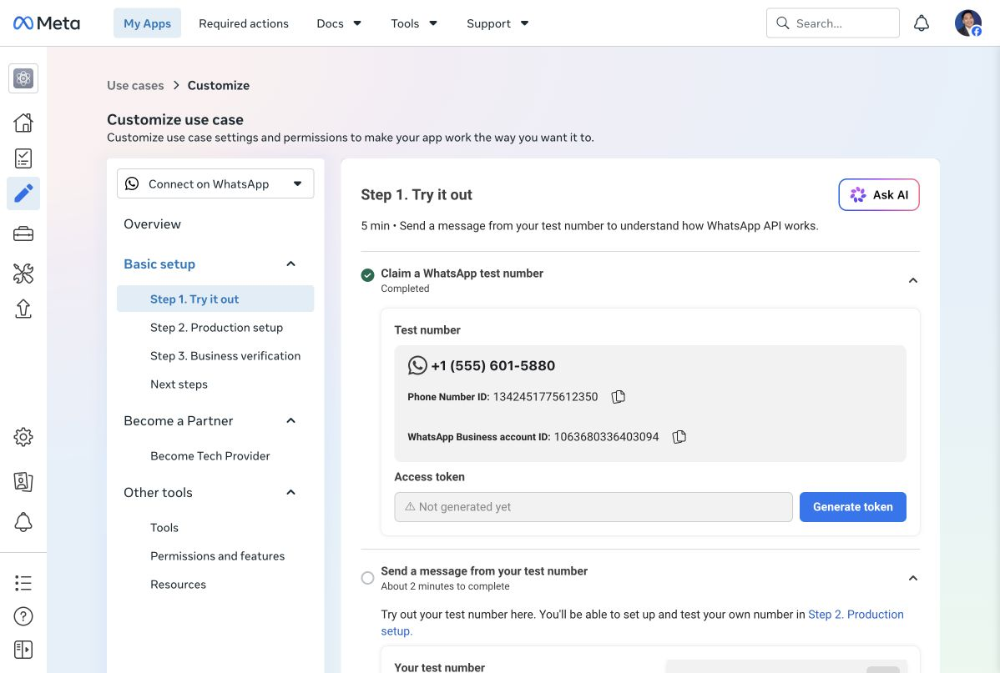

5. Select **Generate token** and keep the result private as `WHATSAPP_ACCESS_TOKEN`. Copy the **Phone Number ID**, rather than the displayed phone number, into `WHATSAPP_PHONE_NUMBER_ID`. Open **App settings → Basic → Show** to retrieve the app secret for `WHATSAPP_APP_SECRET`; Meta may require password re-entry. Never include access tokens or app secrets in screenshots or commits.
6. Add your own WhatsApp number as a test recipient and complete its verification. The live setup has completed this step; the earlier GIF predates it. A provisioned sender number alone does not establish that messages can reach your phone.

7. Start the app and set Meta’s callback to `https://YOUR-PUBLIC-ORIGIN/webhooks/whatsapp`. Supply the matching verify token and subscribe to the **messages** field. Use the same public origin for the Auth0 callback. Keep the tunnel running; expose port 3003 and keep the SDK listener on port 3004 private.

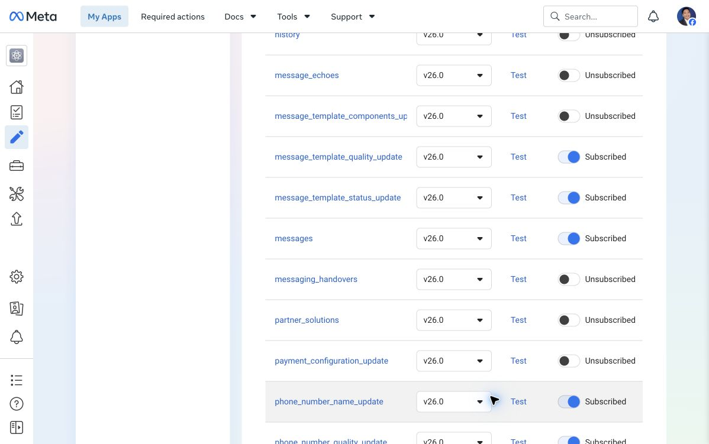

This screenshot shows the **messages field subscription only**. It does not show the callback verification result or prove that this app is subscribed to the WABA.

8. Subscribe the intended app to the **WhatsApp Business Account (WABA)**. Using a token issued by that app with `whatsapp_business_management` permission, send `POST https://graph.facebook.com/<API-VERSION>/<WABA-ID>/subscribed_apps`. Then send `GET` to the same URL and confirm `data[].whatsapp_business_api_data.id` includes your app ID. Use the WABA ID, not the Phone Number ID. Follow the [app README's request examples](../../../apps/whatsapp/README.md#subscribe-the-app-to-the-waba) and Meta's [subscription reference](https://www.postman.com/meta/whatsapp-business-platform/request/tl2wk2j/get-all-subscriptions-for-a-waba).

**Live setup evidence:** the recipient is verified, Meta accepted the callback challenge, the messages field is subscribed, and a GET after the account-subscription POST confirms the intended app. Initially, the account listed only Meta's test webhook viewer app; that entry did not subscribe this demo app.

The dashboard warns that unpublished apps receive dashboard test webhooks, while production data requires publication, including data from app-role users. This is an observed account constraint; it has not been established as a cause of any test-number delivery failure.

The Hello World API request returned HTTP 200 with `message_status: accepted`. Meta's test webhook viewer subsequently reported `status: delivered` for the same message ID, confirming outbound delivery. The app's inbound store still has no greeting; this outbound test does not verify Channels replies or the approval journey. Keep tokens, app secrets, verify tokens, recipient numbers, and raw delivery payloads out of public captures.

## 3. Install and start the app

```bash
npm ci --prefix apps/whatsapp
cp apps/whatsapp/.env.example apps/whatsapp/.env
npm run typecheck --prefix apps/whatsapp
npm test --prefix apps/whatsapp
npm start --prefix apps/whatsapp
```

Edit `apps/whatsapp/.env` privately using the [complete environment reference](../../../apps/whatsapp/.env.example). This app listens on port 3003 and has its own install/lockfile. Use one process with persistent disk. Check the [app README](../../../apps/whatsapp/README.md) for health and operational details.

**Live setup evidence:** the runtime is running and both local and public health checks succeed. Meta also verified the public callback. These checks establish startup and callback routing; an inbound phone message through the app remains unverified.

## 4. Link the original WhatsApp sender

Text `hello`. Open the returned link and select **Continue with Auth0**. Sign in, then send the browser's `LINK <code>` from the original WhatsApp conversation. Check the bot recognizes the linked display name.

**Capture pending:** inbound greeting, Auth0 sign-in entry, the confirmation-code screen, and successful sender-bound linking. Hide the short-lived linking code in public screenshots. Opening a forwarded link alone must not bind a different sender.

## 5. Propose the exact named request

Text `Save a request called team-lunch`. Read the proposed label and request ID. Open the Guardian push and check that it describes the same exact action. Approve it on the enrolled phone.

**Capture pending:** WhatsApp proposal and matching Guardian approval screen. An approval screen alone is not execution evidence.

## 6. Verify the saved receipt and restart

Check the WhatsApp receipt and exact local named-request record. Restart the app, then text `STATUS`. Verify it reports the same saved request. The demo saves a local record; it does not book a lunch or schedule a reminder.

**Capture pending:** actual saved receipt, a sanitized record inspection, and status after restart with the same request ID.

## 7. Demonstrate denial and expiry

After the app's cooldown, propose a different label and deny its Guardian request. Propose another and let the approval expire. Inspect status and the local store: neither may produce a saved record. Retry an inbound delivery to check duplicate handling without creating another request.

**Capture pending:** denied/expired statuses and absence of their records. These are required live checks before describing the complete WhatsApp journey as working.
